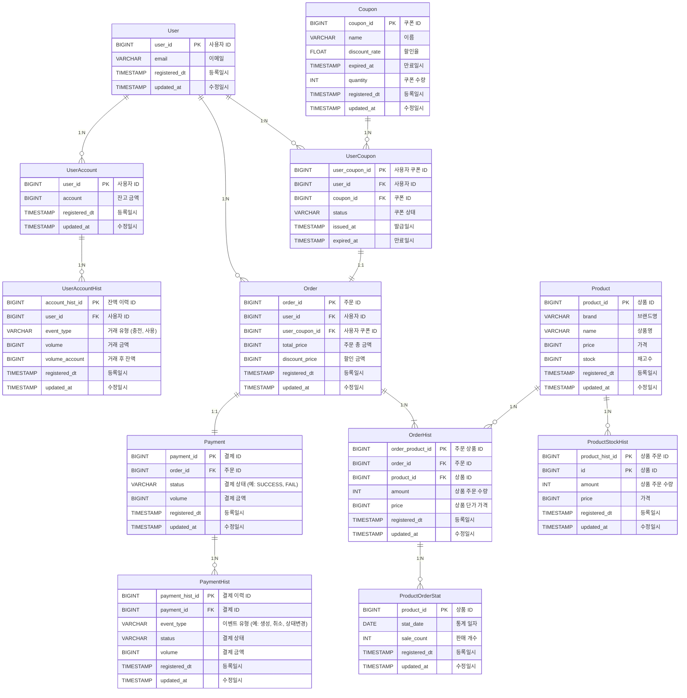

# e-commerce docs

1. [요구사항분석](./Requirements.md)
2. [시퀀스 다이어그램](./Sequence.md)
3. [플로우차트](./FlowChart)
4. [ERD](./ERD.md)
5. [API 명세 문서](./ApiDocs.md)

## ERD

```mermaid

erDiagram
User ||--o{ UserAccount : "1:N"
UserAccount ||--o{ UserAccountHist : "1:N"
User ||--o{ UserCoupon : "1:N"
User ||--o{ Order : "1:N"
Coupon ||--o{ UserCoupon : "1:N"
UserCoupon ||--|| Order : "1:1"
Order ||--|| Payment : "1:1"
Order ||--|{ OrderHist : "1:N"
Product ||--o{ OrderHist : "1:N"
Product ||--o{ ProductStockHist : "1:N"
OrderHist ||--o{ ProductOrderStat : "1:N"
Payment ||--o{ PaymentHist : "1:N"
User {
BIGINT user_id PK "사용자 ID"
VARCHAR email "이메일"
TIMESTAMP registered_dt "등록일시"
TIMESTAMP updated_at "수정일시"
}

    UserAccount {
        BIGINT user_id PK "사용자 ID"
        BIGINT account "잔고 금액"
        TIMESTAMP registered_dt "등록일시"
        TIMESTAMP updated_at "수정일시"
    }

    UserAccountHist {
        BIGINT account_hist_id PK "잔액 이력 ID"
        BIGINT user_id FK "사용자 ID"
        VARCHAR event_type "거래 유형 (충전, 사용)"
        BIGINT volume "거래 금액"
        BIGINT volume_account "거래 후 잔액"
        TIMESTAMP registered_dt "등록일시"
        TIMESTAMP updated_at "수정일시"
    }

    Coupon {
        BIGINT coupon_id PK "쿠폰 ID"
        VARCHAR name "이름"
        FLOAT discount_rate "할인율"
        TIMESTAMP expired_at "만료일시"
        INT quantity "쿠폰 수량"
        TIMESTAMP registered_dt "등록일시"
        TIMESTAMP updated_at "수정일시"
    }

    UserCoupon {
        BIGINT user_coupon_id PK "사용자 쿠폰 ID"
        BIGINT user_id FK "사용자 ID"
        BIGINT coupon_id FK "쿠폰 ID"
        VARCHAR status "쿠폰 상태"
        TIMESTAMP issued_at "발급일시"
        TIMESTAMP expired_at "만료일시"
    }
    Payment {
        BIGINT payment_id PK "결제 ID"
        BIGINT order_id FK "주문 ID"
        VARCHAR status "결제 상태 (예: SUCCESS, FAIL)"
        BIGINT volume "결제 금액"
        TIMESTAMP registered_dt "등록일시"
        TIMESTAMP updated_at "수정일시"
    }
    PaymentHist {
        BIGINT payment_hist_id PK "결제 이력 ID"
        BIGINT payment_id FK "결제 ID"
        VARCHAR event_type "이벤트 유형 (예: 생성, 취소, 상태변경)"
        VARCHAR status "결제 상태"
        BIGINT volume "결제 금액"
        TIMESTAMP registered_dt "등록일시"
        TIMESTAMP updated_at "수정일시"
    }
    Product {
        BIGINT product_id PK "상품 ID"
        VARCHAR brand "브랜드명"
        VARCHAR name "상품명"
        BIGINT price "가격" 
        BIGINT stock "재고수"
        TIMESTAMP registered_dt "등록일시"
        TIMESTAMP updated_at "수정일시"
    }

    ProductStockHist {
        BIGINT product_hist_id PK "상품 주문 ID"
        BIGINT id PK "상품 ID"
        INT amount "상품 주문 수량"
        BIGINT price "가격" 
        TIMESTAMP registered_dt "등록일시"
        TIMESTAMP updated_at "수정일시"
    }

    Order {
        BIGINT order_id PK "주문 ID"
        BIGINT user_id FK "사용자 ID"
        BIGINT user_coupon_id FK "사용자 쿠폰 ID"
        BIGINT total_price "주문 총 금액"
        BIGINT discount_price "할인 금액"
        TIMESTAMP registered_dt "등록일시"
        TIMESTAMP updated_at "수정일시"
    }

    OrderHist {
        BIGINT order_product_id PK "주문 상품 ID"
        BIGINT order_id FK "주문 ID"
        BIGINT product_id FK "상품 ID"
        INT amount "상품 주문 수량"
        BIGINT price "상품 단가 가격"
        TIMESTAMP registered_dt "등록일시"
        TIMESTAMP updated_at "수정일시"
    }


    ProductOrderStat {
        BIGINT product_id PK "상품 ID"
        DATE stat_date "통계 일자"
        INT sale_count "판매 개수"
        TIMESTAMP registered_dt "등록일시"
        TIMESTAMP updated_at "수정일시"
    }

```