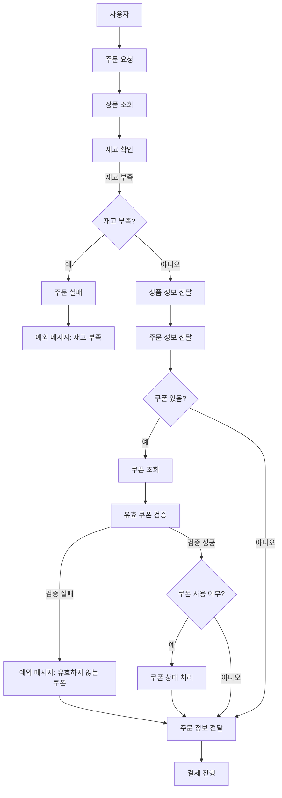
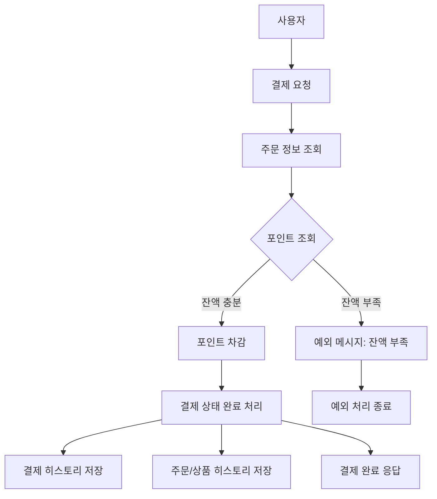
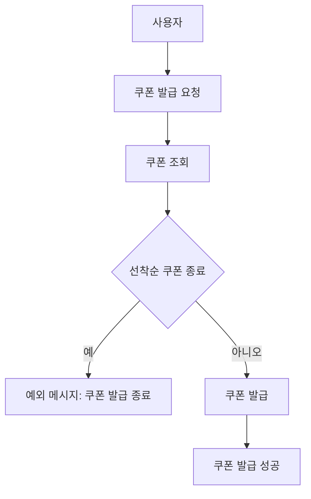
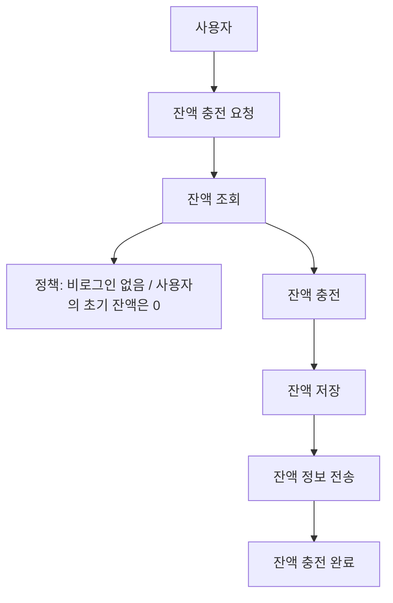
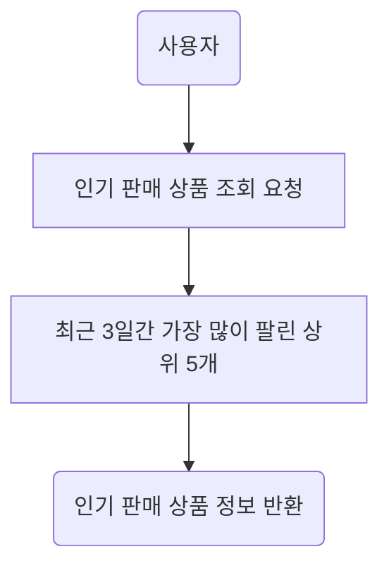

# e-commerce docs

1. [요구사항분석](./Requirements.md)
2. [시퀀스 다이어그램](./Sequence.md)
3. [플로우차트](./FlowChart)
4. [ERD](./ERD.md)
5. [API 명세 문서](./ApiDocs.md)

### FlowChart

> ###  목차
> - [주문 API](#주문)
> - [결제 API](#결제)
> - [쿠폰 발급 API](#쿠폰발급)
> - [잔액 충전 API](#충전)
> - [상위 TOP5 상품 조회 API](#상위-TOP5-상품-조회)
---

### 주문

---
### 결제

---
### 쿠폰발급

---

### 충전

---

### 상위 TOP5 상품 조회

---