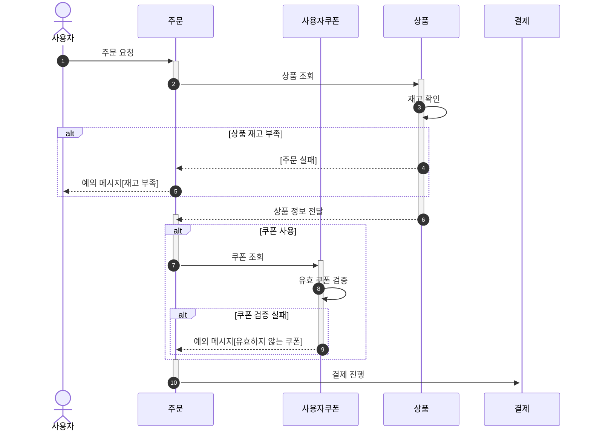
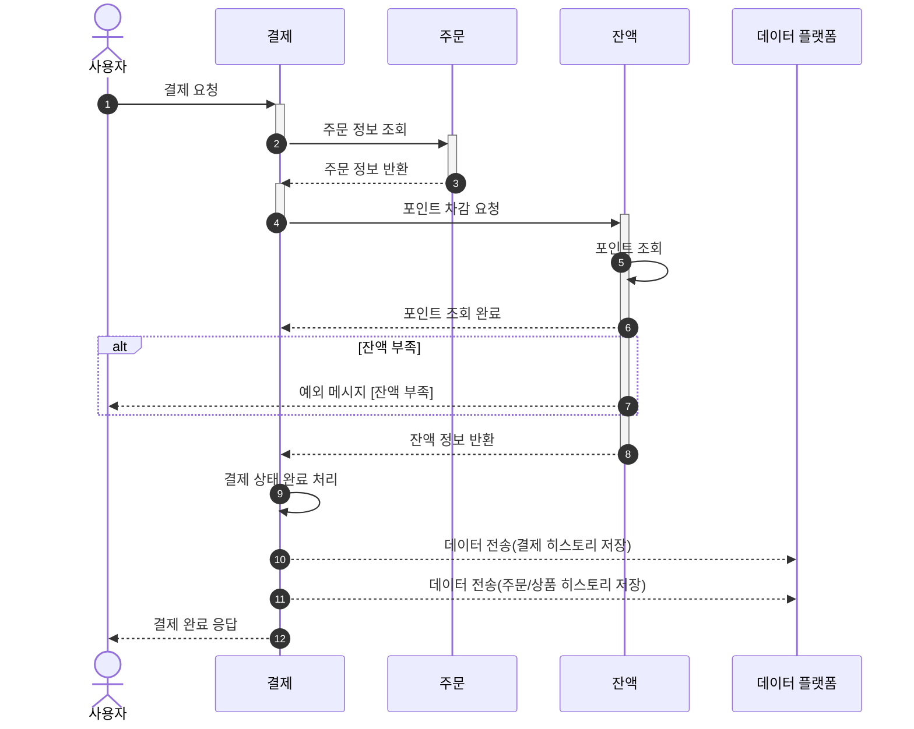
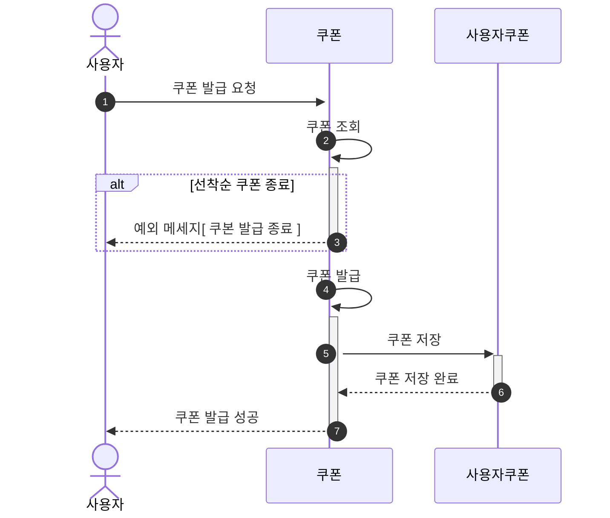
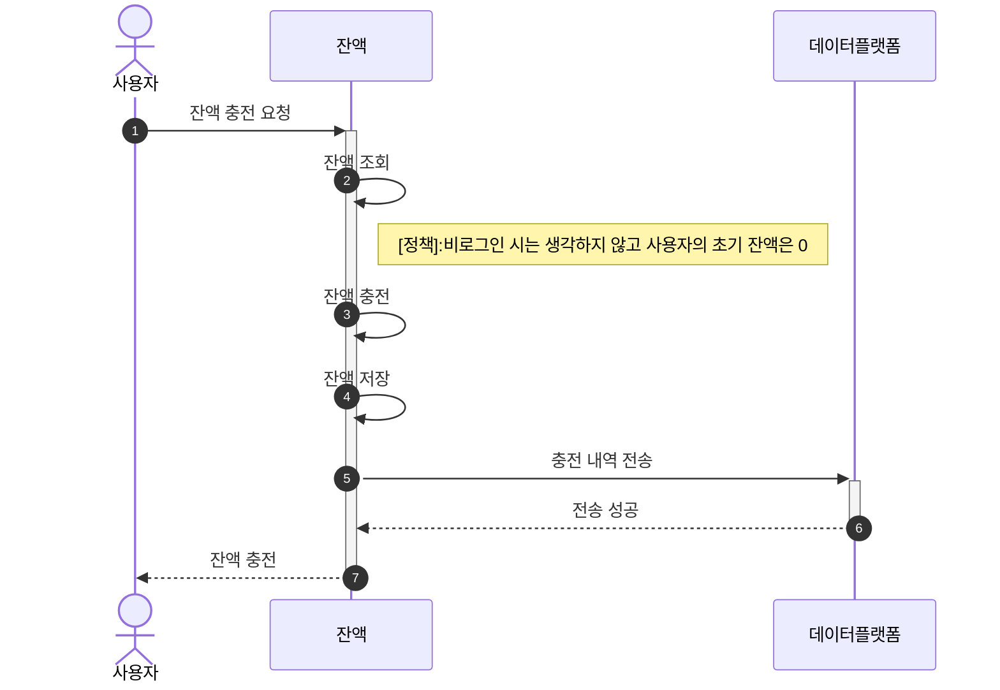
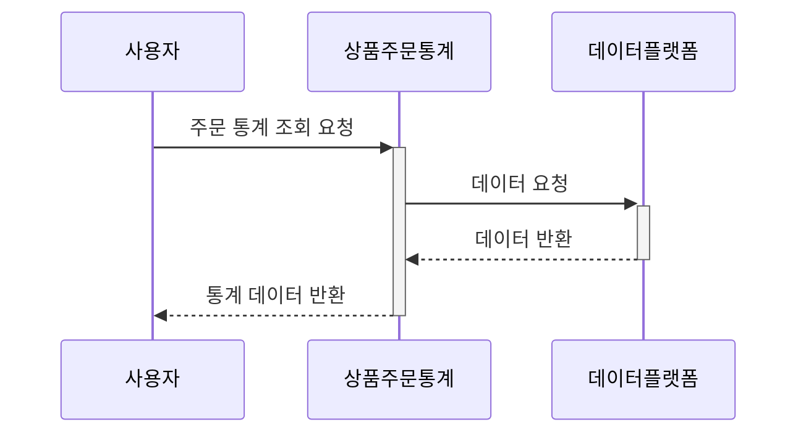

# e-commerce docs

1. [요구사항분석](./Requirements.md)
2. [시퀀스 다이어그램](./Sequence.md)
3. [플로우차트](./FlowChart)
4. [ERD](./ERD.md)
5. [API 명세 문서](./ApiDocs.md)

### 시퀀스 다이어그램

> ###  목차
> - [주문 API](#주문)
> - [결제 API](#결제)
> - [쿠폰 발급 API](#쿠폰-발급)
> - [잔액 충전 API](#잔액-충전)
> - [상위 TOP5 상품 조회 API](#상위-TOP5-상품-조회)
---

> [정책]  
> 기본 사용자 : 잔액 0원 / 쿠폰 0개 / 주문 0건  
> 쿠폰 발급 정책 : 선착순 쿠폰 발급  
> 비로그인 유저 없음  
> 
> * 단순조회는 생략했습니다. 상품 조회 / 잔액 조회 

### 주문

 
---

### 결제

 

---

### 쿠폰 발급

 

---
###  잔액 충전

 

---
### 상위 TOP5 상품 조회

 

---

  
