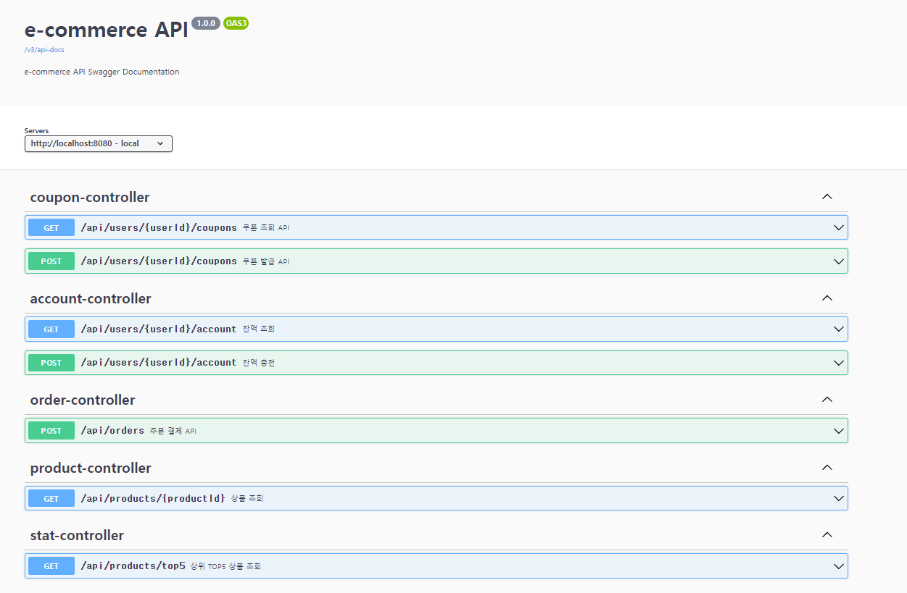
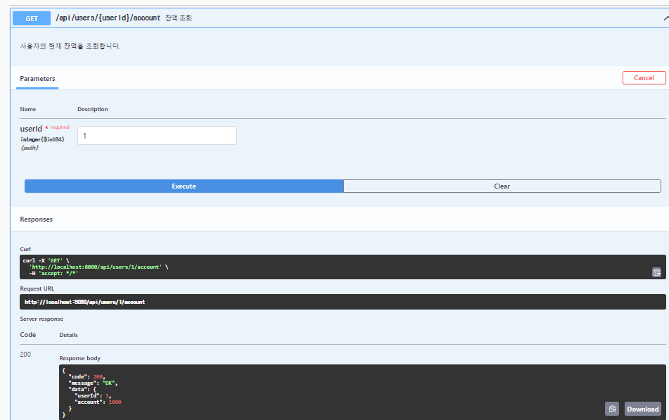
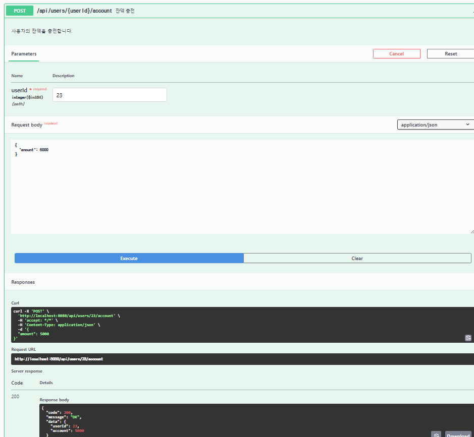
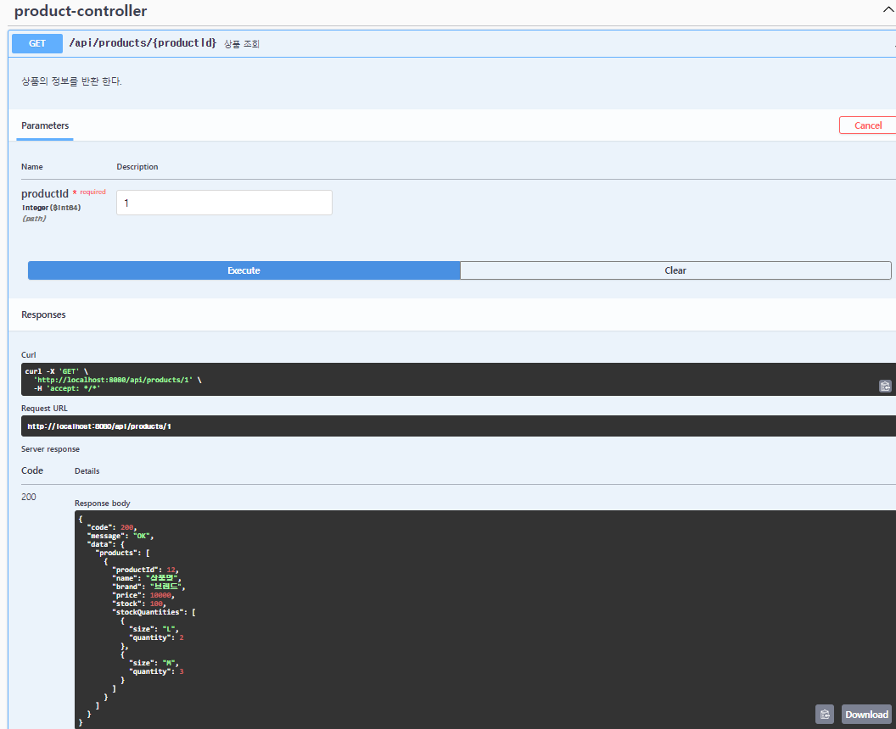
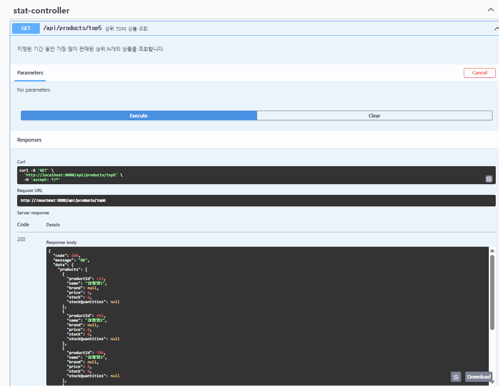
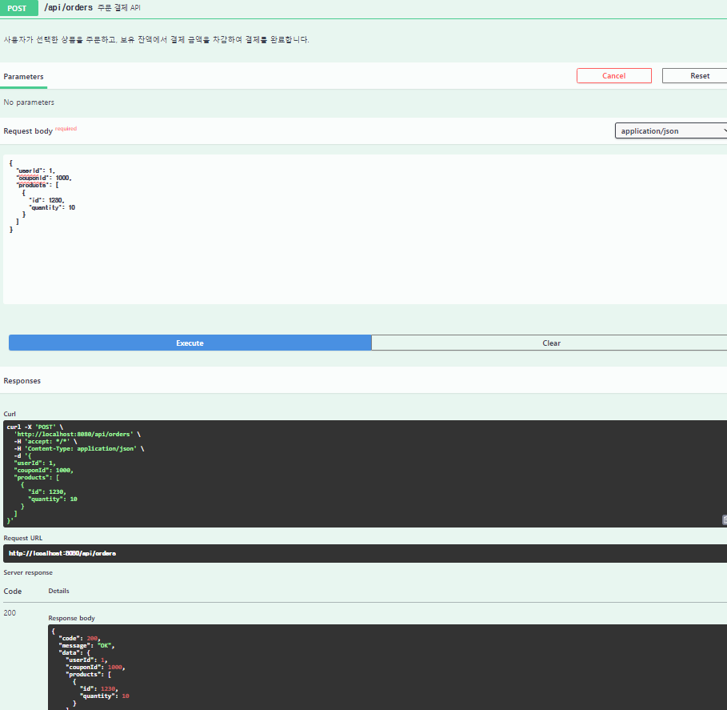
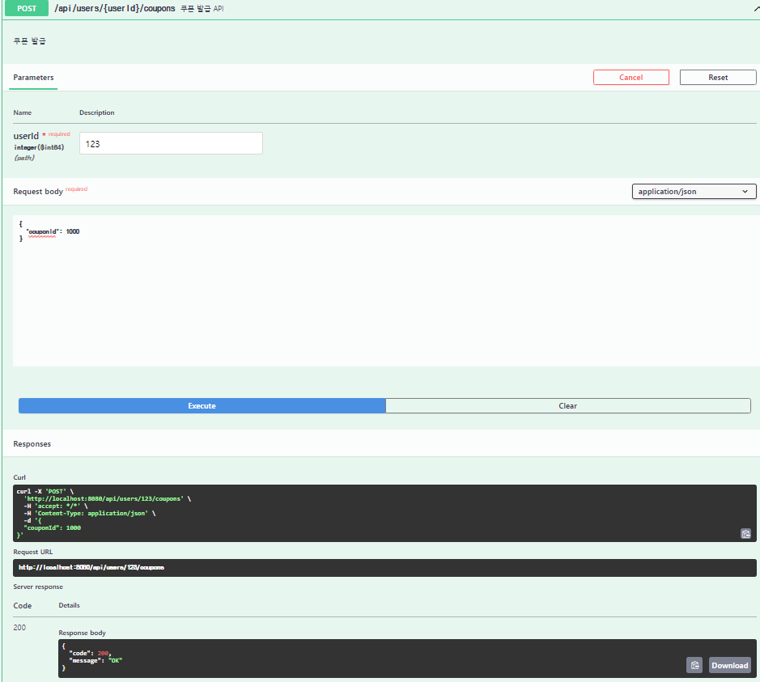
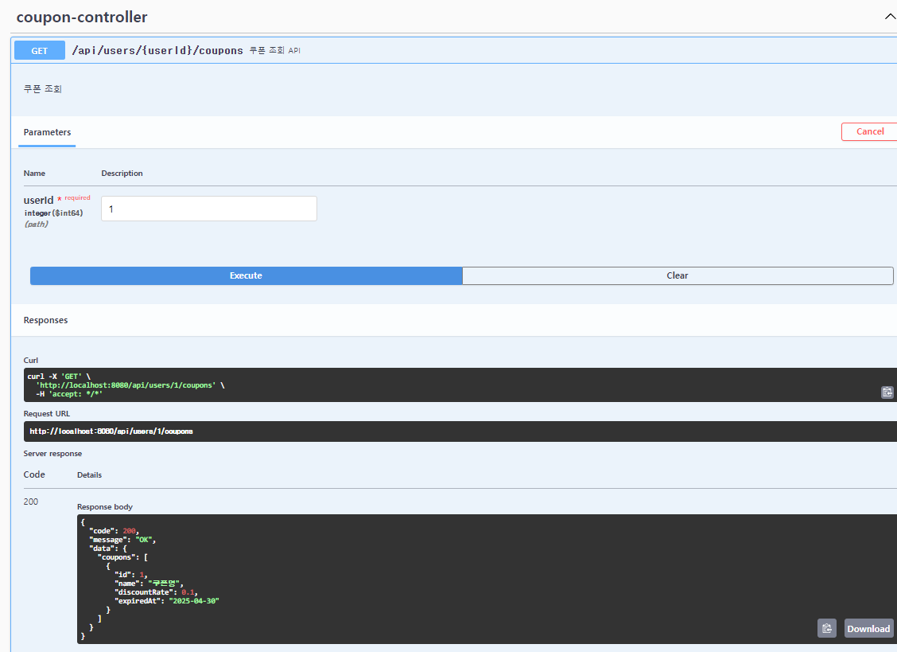

## Swagger Api 문서

[링크](http://localhost:8080/api-docs/swagger-ui/index.html)

---
## 전체 Api

## Account API

---
## 유저 잔액 조회

## 유저 잔액 충전

## PRODUCT API

---
## 상품 단건 조회

## TOP5 상품 조회

## ORDER API

---
## 주문 요청

---
## COUPON API

## 쿠폰 발급

## 쿠폰 조회

